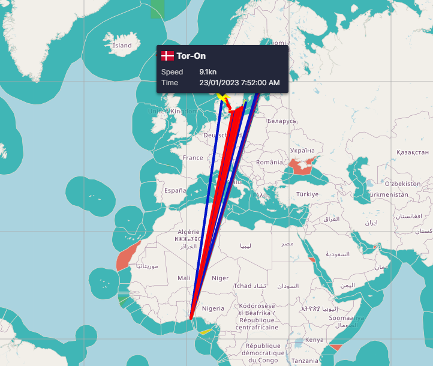
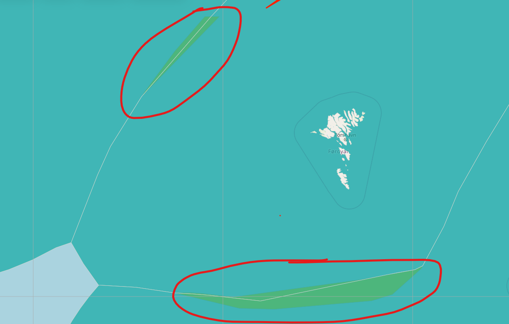

# **𝐄𝐱𝐚𝐦𝐩𝐥𝐞 𝐑𝐞𝐩𝐨𝐫𝐭**

This is an example report for a seasonal fishery analysis. All functions mentioned in this README are located within
this repository unless stated otherwise. The only other repository being referred to is **fishfacts-data-analysis-py**
on branch **activities_profile_tokit_test**.

## **Overview**

This report focuses on **mackerel fisheries in 2023** for three countries:

- **Faroe Islands**
- **Norway**
- **Iceland**

These three countries are usually selected for this type of report because they are the only ones for which we have
consistent catch data.

---

## **1. Sample Vessels**

The three selected vessels for this report are:

| Vessel Name           | Country       | ID  |
|-----------------------|---------------|-----|
| Trondur i Gotu        | Faroe Islands | 9   |
| Jon Kjartansson SU111 | Iceland       | 313 |
| Gerda Marie           | Norway        | 431 |

Typically, **Gilli** selects the sample vessels based on vessel size and quotas to make them comparable. Perhaps this
step should have a more statistical approach?

---

## **2. Main Steps**

The main steps for a seasonal report are:

1. **Getting data** through **fishfacts-data-analysis-py** repository
    - AIS-data
    - Catch data

2. **Processing data**
    - Resample and interpolate
    - Assign EEZ zones
    - Calculate distance (nautical miles)
    - Calculate fuel consumption (liters or m3) and CO2 emissions (kg or tons)

3. **Find trips using trip finder**
    - This is done in the **fishfacts-data-analysis-py** repository
    - It might be necessary to manually verify trips by plotting vessel tracks per trip using *Folium* or by plotting
      speed tracks using *Matplotlib*

4. **Match catch to trips**
    - Join the trip table's *vessel_id* and *end* (trip end) column with the catch table's *vessel_id* and
      *landing_date* columns.
    - Manual verification may be needed to ensure accuracy, as some trips have multiple landings, especially for
      Norwegian vessels.
    - Sort trips to include only *mackerel* trips (specified report species).

5. **Calculate per-trip statistics from processed AIS data**, such as:
    - Duration (hours/days)
    - Distance traveled (nautical miles)
    - Fuel consumption (liters or m3)
    - CO2 emission (kg or tonnes)
    - Fishing hours and transit hours
    - Fishing hours in areas (EEZ zones)

6. **Calculate aggregated metrics** based on the trips dataframe:
    - Mean fuel consumption and CO2 emissions per vessel
    - Mean distance traveled per vessel
    - Mean catch per distance traveled per vessel
    - Mean fishing hours per trip per vessel

7. **Generate heatmaps**
    - Heatmaps for each country, possibly grouped monthly/weekly.

---

## **3. Detailed Description of Each Step**

### **Step 1: Get Data**

#### **AIS Data**

- Retrieved using the function **download_vessel_locations()** from *tokit/get_ais_data.py* in the
  *fishfacts-data-analysis-py* repository.
- Uses vessel IDs instead of names to ensure accuracy.

#### **Catch Data**

- Retrieved using the function **get_catch_for_vessels()** from *tokit/get_catch.py* in the *fishfacts-data-analysis-py*
  repository.

---

### **Step 2: Process the Data**

Processing is handled in **main_process_ais_data.py**.

#### **Resample and Interpolate**

- AIS data is resampled to a **15-minute interval** and interpolated using **resample_with_interpolation()** from
  *resample/resample.py*.

#### **Assign EEZ Zones**

- EEZ zones are assigned using **assign_eez()** from *zoning/zoning.py*.
    - There are some zones that overlap, which causes duplicates rows with one eez zone in each row. The temporary fix
      for this (as of 27. feb 2025) is to simply drop duplicates, since they rarely occur.
- Two types of zones are applied: **"eez_zone"** and **"joined_zone"** (explained in Step 5).

#### **Calculate Distance Traveled**

- Distance is calculated using **calculate_distance()** from *utils/distance.py*. This is the distance between each
  consecutive row.

##### Example 1: AIS error:

Sometimes (rarely) errors occur in the AIS data causing very big jumpts.
An issue was observed with vessel **Tor-On (id: 3313)** from **2023-01-12 to 2023-01-22**, where incorrect locations
were detected. This will cause a very big "distance traveled" for each consecutive point. This can be used to spot these
errors.

#### **Calculate Fuel Consumption**

- Previously used **Meteomatics** weather data (subscription expired, data available until Jan 2025).
- Weather data retrieved using **get_weather()** from *oil_calculation/oil.py*.
- Fuel consumption calculated using **calculate_oil()** from *fuel_consumption/fuel_calculation.py*.

##### Function Arguments:

1. Resampled 15-minute interval AIS dataframe (with weather data).
2. Vessel characteristics (e.g., tonnage, engine power, length), stored in
   *reports/mackerel_report/data/vessel_characteristics.csv*.

---

### **Step 3: Find Trips Using the Trip Finder**

- Uses the trip finder algorithm in **fishfacts-data-analysis-py**.
- Run using **main_trip_finder.py** or **find_trips_locally.py** (if AIS data is stored locally).
    - This function takes the path to the AIS files.
- **Manual verification required**: Trips can be visualized using plots to ensure accuracy.

---

### **Step 4: Match Catch to Trips**

- Catch table (*vessel_id* and *landing_date*) is **joined** with trip table (*vessel_id* and *end*).
- **Challenge:** Landings may be recorded later than the actual arrival time, requiring adjustments.
- **Filtering:** Only select trips where **mackerel** (the species in question) is the dominant species.
- **Manual review recommended** to prevent mismatches.

This can be done using Pandas' "merge_asof" method.

---

### **Step 5: Calculate Tripwise Statistics**

This step is done in script **main_tripwise_stats.py**. The script uses functions from
tripwise_functions/tripwise_metrics.py.
tripwise_metrics.py contains 5 functions.

- perform_interval_join()
    - join trips and AIS dataframe so that each row of AIS is associated to a trip
- calculate_trip_metrics()
    - calculates oil consumption, CO2 and distance traveled per trip.
- calculate_trip_speeds()
    - calculates the time (in hours) spent in each speed group
        - speed groups are "fishing", "transit" and "speedy transit"
- calculate_trip_eez_fishing()
    - calculates the time spent fishing (in speed group "fishing") in each zone.
        - there are joined zones that need to be handled depending on the vessels' flag. See example 2 below for joined
          zones.
- master_function()
    - this function uses all the other functions above.
    - The input dataframe to this function MUST be resampled to 15 minute intervals.

The main function runs all the functions on the appropriate data frames. The resulting dataframe is a long format
including the columns 'start', 'end', 'category', and 'value'

##### Example 2: **joined zones**:

- Some zones are shared between two countries.
- Example: If a Faroese vessel fishes in the **UK-Faroe Islands joined zone**, it is registered under the Faroese EEZ.

#### **Time Spent in Each Activity**

There are three activity types:

1. Fishing (0.3 <= speed < 7.5)
2. Transit (7.5 <= speed < 10)
3. Speedy transit (10 <= speed)

---

## **4. Checkpoint**

At this stage, after applying the master_function() from tripwise_functions/tripwise_metrics.py, you should have a table
containing:

| Column Name                    | Description                                       |
|--------------------------------|---------------------------------------------------|
| vessel_id                      | Vessel identifier                                 |
| vessel_name                    | Vessel name                                       |
| vessel_imo                     | IMO number                                        |
| vessel_type                    | Type of vessel                                    |
| vessel_flag                    | Country flag                                      |
| start                          | Start time of trip                                |
| end                            | End time of trip                                  |
| traveled_distance              | Total distance traveled in nautical miles         |
| duration                       | Duration of trip                                  |
| highest_speed                  | Highest recorded speed                            |
| economy_speed                  | Economy speed                                     |
| average_speed                  | Average speed                                     |
| average_fishing_speed          | Average speed while fishing                       |
| activity_at_harbour_percentage | % of time at harbor                               |
| activity_fishing_percentage    | % of time fishing                                 |
| activity_transit_percentage    | % of time in transit                              |
| fishing_hours                  | Hours in speeds 0.3 to 7.5 knots                  |
| transit_hours                  | Hours in speeds 7.5 to 10 knots                   |
| speed_transit_hours            | Hours in speeds above 10 knots                    |
| fishing_hours_eez_zone         | Fishing hours in each zone the vessel has been to |
| total_consumption_l            | Total fuel consumption to l                       |
| species                        | Main species caught                               |
| volume                         | Weight of catch in kg                             |

From here, additional metrics can be derived:

---

### **Step 6: Calculate Aggregated Metrics**

Now we have sufficient data to calculate aggregated values grouped in different ways.

- **Grouped by country and vessel**.

---

### **Step 7: Generate Heatmaps**

- Create **heatmaps per country**, possibly grouped by **month or week**.

The heatmaps are created using function **plot_heatmap()** in plotting/plot.py

Heatmaps are made based on clusters of data points, specifically data points during fishing speeds (0.3 to 7.5 knots).
These can be made as monthly per country, weekly per country. Depending on the need.

---
